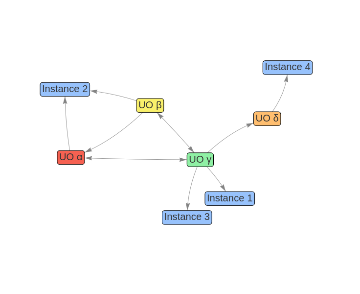

I see nielsevents as an *instance* of an unconditional organizing philosophy (UOP), or an unconditional organizing authority (UOA). These 2 (UOP and UOA) can be used interchangeably, because a philosophy shapes how people think and thus has power. I believe power should be used responsibly or not at all. Using power makes one an authority. So any UOP is also an UOA.

Multiple UOPs can exist simultaneously. I believe this to be healthy.

There might be a possibility for a network of UOPs. I envision this to be some decentralized network where no single UOP has all the power. 

Rules for this network might include:
- All UOPs keep a public list of all other known UOPs and actively inform instances about other possibilities.
-All research data is public
-UOPs not following the rules will be actively warned against by UOPs in the network
-and more...

Finally, there could even be multiple networks. This could be the case when people disagree about the metastructure of the UO network.

## Scope
Currently, instances and philosophies are slowly emerging. Many still struggle to keep integrity, given the harsch reality. 

For me personally, it's already quite a challenge to keep my instance running sustainably. I can slowly contribute some knowledge/tools to the UOA currently known as unconditionalevents.com. To create a network seems out of reach. 

Many contribute to my instance, but only 3-4 people understand it for what it is. And of those 3-4 people, none are currently able to run the instance together.

Let alone form the UOA.

I've decided to start at the bottom and generate the energy I wish to see. From that place on I hope to meet people who understand.

## Goal

Envision a highty enlightened individual/community organizing an unconditional healing event.

> You go to a meeting in the forest where you are guided into presence (self-healing). In that presence you meet others(collective healing) and find connection. When you get home your deepest needs (true healing) are fulfilled and you have more energy (sustainability & growth) than you had before. The meeting did not require anything from you. It was unconditionally given.

Let's start from questions:

Let's assume our life goal is to lessen suffering / increase love. 

- Would this lessen the suffering in the world?
- How do we define suffering?

Assuming this would indeed lessen suffering and assuming there is some way for a group of people to gain consensus about a definition of suffering.

- Is it worthwhile to experiment with different UOPs as an attempt to move towards this ideal?

I believe the answer for me is YES. I have based this on what I have felt and what I have connected about with other people. 

I believe any UOP should have a way to do integrity checks. Any UOP should be willing to assume that they could be wrong. Open to not knowing. Nothing is black or white. 

## Conclusion

Nielsevents is an instance of an emerging UO philosophy (in embriotic phase). It is highly specific and personal. It brings the energy of this UOP into the world to see what result it gets. I do not fully understand why I do this. There might be dark reasons. I myself am open to not knowing. I keep humble and practice. I base as much as possible on love. I am also highly traumatized and make mistakes. I am inconsistent. Non-duality, but also just wrong sometimes. Something like that.
